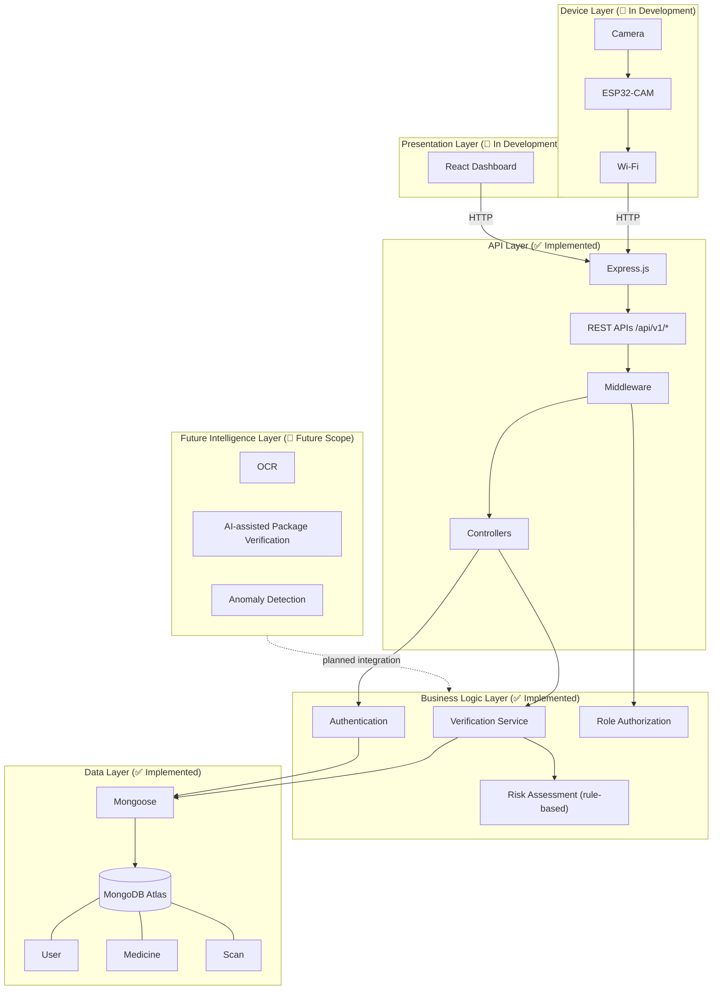
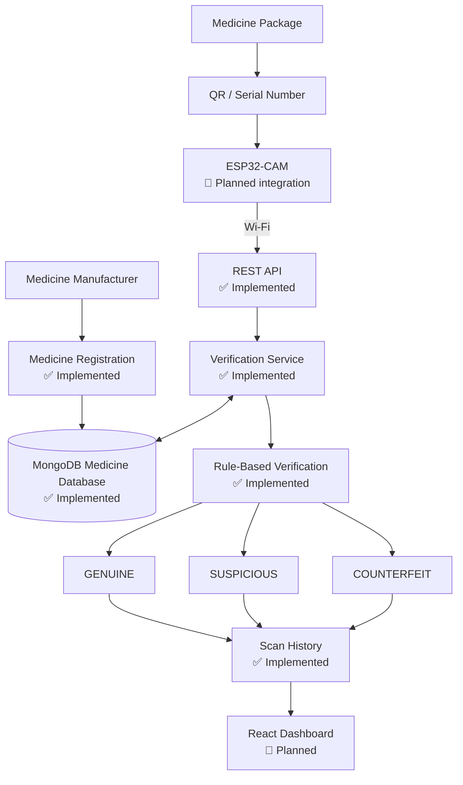
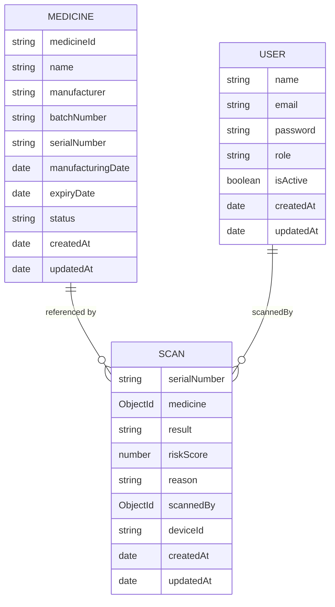
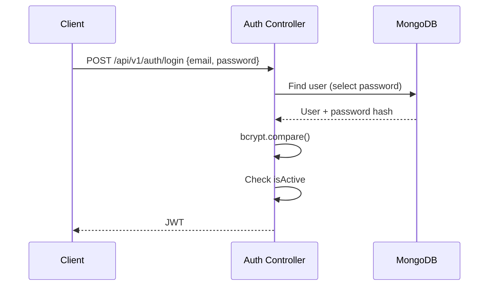
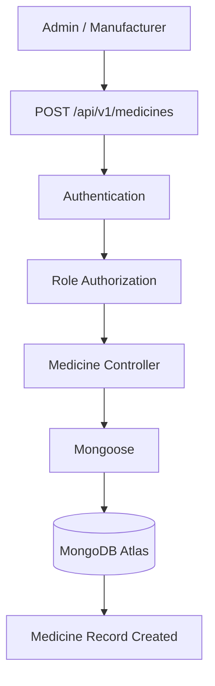
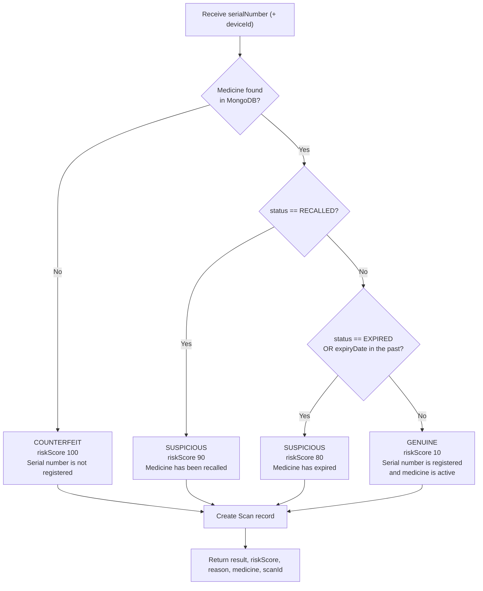
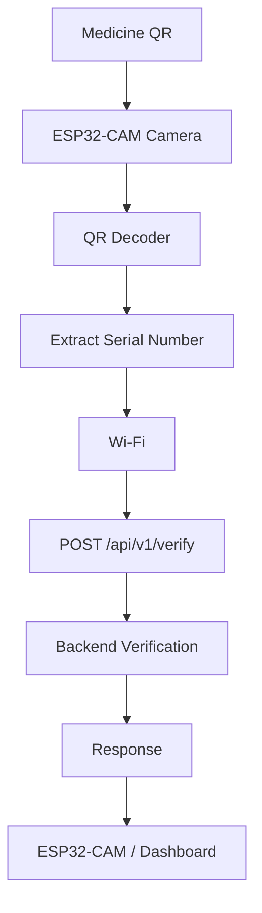
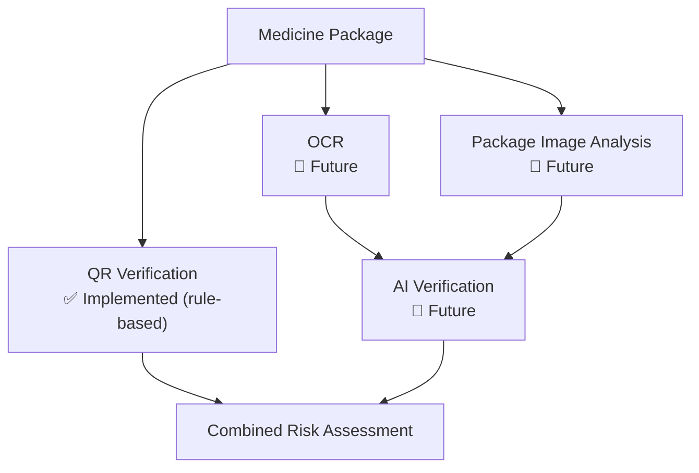

# MediSure
### Smart IoT-Based Medicine Authentication and Verification System


> **Final-year B.Tech project** · Ajay Kumar Garg Engineering College, Ghaziabad · Information Technology

---

## Table of Contents

- [Implementation Status Legend](#implementation-status-legend)
- [Overview](#overview)
- [Problem Statement](#problem-statement)
- [Objectives](#objectives)
- [Key Features](#key-features)
- [Architecture](#architecture)
- [System Workflow](#system-workflow)
- [Technology Stack](#technology-stack)
- [Project Structure](#project-structure)
- [Database Design](#database-design)
- [Authentication & Authorization](#authentication--authorization)
- [Medicine Registration](#medicine-registration)
- [Medicine Verification](#medicine-verification)
- [Scan History](#scan-history)
- [API Documentation](#api-documentation)
- [Installation](#installation)
- [Environment Variables](#environment-variables)
- [Running the Project](#running-the-project)
- [Testing](#testing)
- [Error Handling](#error-handling)
- [ESP32-CAM Integration](#esp32-cam-integration)
- [React Dashboard](#react-dashboard)
- [AI/OCR Extension](#aiocr-extension)
- [Anomaly Detection](#anomaly-detection)
- [Security](#security)
- [Limitations](#limitations)
- [Future Scope](#future-scope)
- [Development Roadmap](#development-roadmap)
- [Contributors](#contributors)
- [License](#license)

---

## Implementation Status Legend

| Label | Meaning |
|-------|---------|
| ✅ Implemented | Present in the current backend codebase |
| 🚧 In Development | Planned for the current project scope; not yet complete in the repository |
| 🔮 Future Scope | Possible extension beyond the current project scope |

---

## Overview

**MediSure** is an IoT-enabled medicine verification system designed to provide **first-level authentication** of medicines using QR/serial-number-based identification, centralized medicine records, a REST API backend, scan history, and a web dashboard.

The planned system uses an **ESP32-CAM** to capture a medicine package QR code, transmit the decoded identifier over Wi-Fi to the backend, verify the identifier against centralized medicine records stored in **MongoDB**, classify the result as **Genuine**, **Suspicious**, or **Counterfeit**, and maintain scan history.

| Component | Status |
|-----------|--------|
| Backend REST API (Node.js / Express.js) | ✅ Implemented |
| MongoDB Atlas + Mongoose data layer | ✅ Implemented |
| JWT authentication and role-based access control | ✅ Implemented |
| Medicine registration and lookup | ✅ Implemented |
| Rule-based verification engine | ✅ Implemented |
| Scan history | ✅ Implemented |
| React dashboard | 🚧 In Development |
| ESP32-CAM firmware and QR decoding | 🚧 In Development |
| OCR / AI-assisted package verification | 🔮 Future Scope |
| Scan anomaly detection | 🔮 Future Scope |

> **Important:** QR/serial verification alone does **not** prove the physical authenticity or chemical composition of a medicine. See [Limitations](#limitations).

---

## Problem Statement

Counterfeit medicines can contain incorrect ingredients, incorrect dosages, or no effective active ingredient. Manual inspection of packaging is unreliable, and laboratory-based authentication is expensive and time-consuming. Consumers and pharmacies need a convenient **first-level** mechanism to verify medicine packages against trusted medicine records.

MediSure addresses this by combining:

- IoT-based scanning
- QR/serial-number identification
- Centralized medicine records
- REST API verification
- Rule-based risk assessment
- Scan history
- Role-based access
- Web dashboard
- Future AI/OCR extensions

---

## Objectives

1. Provide a centralized registry of medicine records that authorized users can create and query.
2. Verify a scanned serial number against the registry and return a classification with a risk score and reason.
3. Record every verification attempt for auditing and monitoring.
4. Restrict sensitive operations using authentication and role-based authorization.
5. Design the system so that an ESP32-CAM device and a React dashboard can integrate with the same REST API.
6. Lay groundwork for OCR, AI-assisted package verification, and scan-anomaly detection.

---

## Key Features

### ✅ Implemented

- User registration and login with **bcrypt**-hashed passwords
- **JWT**-based authentication with Bearer tokens
- **Role-based access control** (`ADMIN`, `MANUFACTURER`, `PHARMACIST`)
- Medicine registration and retrieval APIs
- Rule-based verification via `POST /api/v1/verify`
- Risk score (0–100) and human-readable reason for every result
- Scan record created for **every** verification attempt
- Scan history retrieval (all scans, or by serial number)
- Account active-state checks
- Environment-variable-based configuration

### 🚧 In Development

- React dashboard
- ESP32-CAM QR capture and Wi-Fi transmission

### 🔮 Future Scope

- OCR and AI-assisted package verification
- Scan anomaly detection
- See [Future Scope](#future-scope)

---

## Architecture

The repository currently follows a **backend-first** architecture. The diagram below distinguishes implemented components from planned ones.



| Layer | Components | Status |
|-------|------------|--------|
| Device | ESP32-CAM, camera, Wi-Fi | 🚧 In Development |
| API | Express.js, REST APIs, controllers, middleware | ✅ Implemented |
| Business Logic | Verification service, authentication, role authorization, risk assessment | ✅ Implemented |
| Data | Mongoose, MongoDB Atlas, `User`, `Medicine`, `Scan` | ✅ Implemented |
| Presentation | React dashboard | 🚧 In Development |
| Future Intelligence | OCR, AI-assisted package verification, anomaly detection | 🔮 Future Scope |

---

## System Workflow



---

## Technology Stack

| Area | Technology | Status |
|------|------------|--------|
| Runtime | Node.js | ✅ |
| Framework | Express.js | ✅ |
| Language | JavaScript (ES Modules) | ✅ |
| Database | MongoDB Atlas | ✅ |
| ODM | Mongoose | ✅ |
| Password hashing | bcryptjs | ✅ |
| Authentication | JSON Web Tokens (JWT) | ✅ |
| Configuration | dotenv | ✅ |
| Cross-origin requests | cors | ✅ |
| Dev tooling | nodemon | ✅ |
| Testing tool | Postman | ✅ |
| Editor / VCS | VS Code, Git/GitHub | ✅ |
| Frontend | React.js | 🚧 Planned |
| IoT hardware | ESP32-CAM, Wi-Fi | 🚧 Planned |
| Firmware tooling | Arduino IDE | 🚧 Planned |

---

## Project Structure

```text
MediSure/
├── backend/
│   ├── src/
│   │   ├── config/
│   │   │   └── db.js                      # MongoDB connection
│   │   ├── controllers/
│   │   │   ├── auth.controller.js
│   │   │   ├── medicine.controller.js
│   │   │   ├── verification.controller.js
│   │   │   └── scan.controller.js
│   │   ├── middleware/
│   │   │   ├── auth.middleware.js         # JWT verification
│   │   │   └── role.middleware.js         # Role authorization
│   │   ├── models/
│   │   │   ├── User.js
│   │   │   ├── Medicine.js
│   │   │   └── Scan.js
│   │   ├── routes/
│   │   │   ├── auth.routes.js
│   │   │   ├── medicine.routes.js
│   │   │   ├── verification.routes.js
│   │   │   └── scan.routes.js
│   │   ├── services/
│   │   │   └── verification.service.js    # Verification rules
│   │   ├── app.js
│   │   └── server.js
│   ├── .env                               # Not committed (see Security)
│   ├── .gitignore
│   └── package.json
└── frontend/                              # 🚧 Planned React dashboard
```

| Directory | Responsibility |
|-----------|----------------|
| `config/` | Database connection setup |
| `controllers/` | Request handling and response construction |
| `middleware/` | Authentication and role authorization |
| `models/` | Mongoose schemas |
| `routes/` | Route definitions mapped to controllers |
| `services/` | Business logic (verification rules) |

---

## Database Design

MediSure uses **MongoDB Atlas** with **Mongoose** schemas.



### User

| Field | Notes |
|-------|-------|
| `name` | User's name |
| `email` | Used for login; duplicate emails are rejected |
| `password` | Stored as a **bcrypt hash**; schema uses `select: false` and is explicitly selected during login |
| `role` | `ADMIN`, `MANUFACTURER`, or `PHARMACIST` |
| `isActive` | Inactive accounts are rejected |
| `createdAt`, `updatedAt` | Timestamps |

### Medicine

| Field | Notes |
|-------|-------|
| `medicineId` | Identifier for the medicine product/record |
| `name` | Medicine name |
| `manufacturer` | Manufacturer name |
| `batchNumber` | Production batch identifier |
| `serialNumber` | **Unique** identifier for an individual package/unit; the value verified during scanning |
| `manufacturingDate` | Date of manufacture |
| `expiryDate` | Expiry date; used by verification |
| `status` | `ACTIVE`, `RECALLED`, or `EXPIRED` |
| `createdAt`, `updatedAt` | Timestamps |

### Scan

| Field | Notes |
|-------|-------|
| `serialNumber` | Serial number that was submitted for verification |
| `medicine` | Reference to the matched medicine (if any) |
| `result` | `GENUINE`, `SUSPICIOUS`, or `COUNTERFEIT` |
| `riskScore` | Integer range **0–100** |
| `reason` | Human-readable explanation of the result |
| `scannedBy` | Reference to the user, where applicable |
| `deviceId` | Identifier of the scanning device (e.g., `ESP32-CAM-001`) |
| `createdAt`, `updatedAt` | Timestamps |

---

## Authentication & Authorization

### Registration flow ✅

1. Client sends `name`, `email`, `password`, and optionally `role`.
2. Backend validates required fields.
3. Backend checks whether the email already exists.
4. Password is hashed using **bcrypt**.
5. User is stored in MongoDB.
6. A **JWT** is generated.
7. The JWT and basic user information are returned.

### Login flow ✅

1. Client sends `email` and `password`.
2. Backend retrieves the user.
3. The password hash is explicitly selected (`select: false` by default).
4. bcrypt compares the submitted password with the stored hash.
5. Backend checks whether the account is active.
6. A JWT is generated.
7. The JWT is returned.



### Protected routes ✅

Protected routes require the header:

```http
Authorization: Bearer <JWT_TOKEN>
```

The **authentication middleware** (`auth.middleware.js`):

1. Reads the `Authorization` header.
2. Extracts the Bearer token.
3. Verifies the JWT.
4. Finds the corresponding user.
5. Checks whether the account is active.
6. Attaches the user to `req.user`.

### Role-based access control ✅

| Role | Register medicines | Scan history (all) | Scan history (by serial) | Notes |
|------|:------------------:|:------------------:|:------------------------:|-------|
| `ADMIN` | ✅ | ✅ | ✅ | Can access administrative functionality |
| `MANUFACTURER` | ✅ | ✅ | ✅ | |
| `PHARMACIST` | ❌ | ❌ | ✅ | Cannot register medicines |

#### Role middleware

`role.middleware.js` exposes an `authorize(...allowedRoles)` function. It is used **after** the authentication middleware, so `req.user` is already populated. `authorize` accepts one or more role names and returns a middleware that compares `req.user.role` against that list:

- If the user's role is in `allowedRoles`, the request continues to the controller.
- Otherwise, the request is rejected with **403 Forbidden**.

Illustrative usage pattern:

```js
// Illustrative — see medicine.routes.js for the actual route definitions
router.post("/", protect, authorize("ADMIN", "MANUFACTURER"), createMedicine);
```

> **Production note:** A production deployment should use stricter role-management policies and must **not** allow arbitrary users to self-register as `ADMIN`. See [Security](#security).

---

## Medicine Registration

Medicine records are created by `ADMIN` or `MANUFACTURER` users.



### Purpose of key fields

| Field | Purpose |
|-------|---------|
| `medicineId` | Identifies the medicine product/record |
| `batchNumber` | Groups packages produced in the same batch; useful for batch-level tracking and recalls |
| `serialNumber` | Unique per package; this is the identifier encoded in the QR code and looked up during verification |
| `manufacturingDate` | Records when the batch/unit was manufactured |
| `expiryDate` | Verification marks medicines past this date as suspicious |
| `status` | `ACTIVE`, `RECALLED`, or `EXPIRED`; drives verification outcomes |

---

## Medicine Verification

**Endpoint:** `POST /api/v1/verify`

### Process ✅



1. Receive `serialNumber`.
2. Search MongoDB for the medicine.
3. Apply rules in order (see table below).
4. Create a **Scan** record for **every** verification attempt.
5. Return `result`, `riskScore`, `reason`, `medicine`, and `scanId`.

### Verification Decision Table

| Condition | Result | Risk Score | Reason |
|-----------|--------|:----------:|--------|
| Unregistered serial | `COUNTERFEIT` | 100 | Serial number is not registered |
| Recalled medicine | `SUSPICIOUS` | 90 | Medicine has been recalled |
| Expired medicine (`EXPIRED` status or `expiryDate` in the past) | `SUSPICIOUS` | 80 | Medicine has expired |
| Registered active medicine | `GENUINE` | 10 | Serial number is registered and medicine is active |

> These are **project-specific rules**. They are **not** regulatory, pharmacopoeial, or medical standards.

### What "GENUINE" means

In MediSure, `GENUINE` currently means only that the submitted identifier **matched a registered, active medicine record and passed the implemented database and rule checks**.

It does **not** mean the physical medicine, its chemical composition, or its packaging has been scientifically verified.

---

## Scan History

Every verification creates a `Scan` record. Stored scans can support:

| Use | Description |
|-----|-------------|
| Auditing | Review who/what verified which serial number and when |
| Verification tracking | Trace the outcome of each verification attempt |
| Detecting repeated scans | Identify the same serial number being verified many times |
| Monitoring suspicious activity | Review `SUSPICIOUS` / `COUNTERFEIT` results |
| Dashboard analytics | Feed charts and summaries in the planned dashboard |
| Future anomaly detection | Provide input signals (🔮 Future Scope) |

### Endpoints ✅

| Endpoint | Authentication | Allowed roles |
|----------|:--------------:|---------------|
| `GET /api/v1/scans` | Required (JWT) | `ADMIN`, `MANUFACTURER` |
| `GET /api/v1/scans/serial/:serialNumber` | Required (JWT) | `ADMIN`, `MANUFACTURER`, `PHARMACIST` |

---

## API Documentation

**Base URL (local):** `http://localhost:5000`
**API prefix:** `/api/v1`
**Content type:** `application/json`

> **Note:** Response examples below include only fields documented for this project. Envelope structure and additional fields (for example, the exact shape of the `user` or `medicine` objects) follow the implementation in the controllers — verify against your running instance.

### Endpoint Summary

| Method | Endpoint | Auth | Roles | Purpose |
|--------|----------|:----:|-------|---------|
| GET | `/` | No | — | Health/root check |
| POST | `/api/v1/auth/register` | No | — | Register a user |
| POST | `/api/v1/auth/login` | No | — | Log in and receive JWT |
| POST | `/api/v1/medicines` | Yes | `ADMIN`, `MANUFACTURER` | Register a medicine |
| GET | `/api/v1/medicines` | Yes* | See note | List medicines |
| GET | `/api/v1/medicines/:serialNumber` | Yes* | See note | Get a medicine by serial number |
| POST | `/api/v1/verify` | See note | — | Verify a serial number |
| GET | `/api/v1/scans` | Yes | `ADMIN`, `MANUFACTURER` | List all scans |
| GET | `/api/v1/scans/serial/:serialNumber` | Yes | `ADMIN`, `MANUFACTURER`, `PHARMACIST` | Scans for one serial number |

> \* Confirm the exact authentication and role requirements for the medicine read endpoints and the verify endpoint in `medicine.routes.js` and `verification.routes.js`, and update this table to match.

---

### Health / Root

#### `GET /`

- **Purpose:** Confirm that the server is running.
- **Authentication:** Not required.
- **Request body:** None.

```bash
curl http://localhost:5000/
```

- **Status codes:** `200 OK`

---

### Authentication

#### `POST /api/v1/auth/register`

- **Purpose:** Create a new user account and receive a JWT.
- **Authentication:** Not required.
- **Request body:**

| Field | Required | Description |
|-------|:--------:|-------------|
| `name` | Yes | User's name |
| `email` | Yes | Unique email |
| `password` | Yes | Plain-text password (hashed with bcrypt before storage) |
| `role` | No | `ADMIN`, `MANUFACTURER`, or `PHARMACIST` |

**Example request**

```bash
curl -X POST http://localhost:5000/api/v1/auth/register \
  -H "Content-Type: application/json" \
  -d '{
    "name": "Test Manufacturer",
    "email": "manufacturer@example.com",
    "password": "ChangeMe123!",
    "role": "MANUFACTURER"
  }'
```

**Example response** (JWT and basic user information)

```json
{
  "token": "<JWT_TOKEN>",
  "user": {
    "name": "Test Manufacturer",
    "email": "manufacturer@example.com",
    "role": "MANUFACTURER"
  }
}
```

**Status codes**

| Code | Meaning |
|------|---------|
| 201 | User created |
| 400 | Missing required fields |
| 409 | Email already exists |
| 500 | Server error |

---

#### `POST /api/v1/auth/login`

- **Purpose:** Authenticate a user and receive a JWT.
- **Authentication:** Not required.
- **Request body:** `email`, `password`

**Example request**

```bash
curl -X POST http://localhost:5000/api/v1/auth/login \
  -H "Content-Type: application/json" \
  -d '{
    "email": "manufacturer@example.com",
    "password": "ChangeMe123!"
  }'
```

**Example response**

```json
{
  "token": "<JWT_TOKEN>"
}
```

**Status codes**

| Code | Meaning |
|------|---------|
| 200 | Login successful |
| 400 | Missing email or password |
| 401 | Invalid credentials |
| 403 | Account is inactive |
| 500 | Server error |

---

### Medicines

#### `POST /api/v1/medicines`

- **Purpose:** Register a new medicine record.
- **Authentication:** Required (`Authorization: Bearer <TOKEN>`).
- **Allowed roles:** `ADMIN`, `MANUFACTURER`.
- **Request body:**

| Field | Description |
|-------|-------------|
| `medicineId` | Medicine record identifier |
| `name` | Medicine name |
| `manufacturer` | Manufacturer name |
| `batchNumber` | Batch number |
| `serialNumber` | Unique serial number |
| `manufacturingDate` | Manufacturing date |
| `expiryDate` | Expiry date |
| `status` | `ACTIVE`, `RECALLED`, or `EXPIRED` |

**Example request**

```bash
curl -X POST http://localhost:5000/api/v1/medicines \
  -H "Content-Type: application/json" \
  -H "Authorization: Bearer <TOKEN>" \
  -d '{
    "medicineId": "MED-001",
    "name": "Amoxicillin 500mg",
    "manufacturer": "MediSure Pharma",
    "batchNumber": "BATCH-2026-001",
    "serialNumber": "SN-MED-001-00001",
    "manufacturingDate": "2026-01-10",
    "expiryDate": "2028-01-10",
    "status": "ACTIVE"
  }'
```

**Example response** (created medicine record)

```json
{
  "medicineId": "MED-001",
  "name": "Amoxicillin 500mg",
  "manufacturer": "MediSure Pharma",
  "batchNumber": "BATCH-2026-001",
  "serialNumber": "SN-MED-001-00001",
  "manufacturingDate": "2026-01-10T00:00:00.000Z",
  "expiryDate": "2028-01-10T00:00:00.000Z",
  "status": "ACTIVE"
}
```

**Status codes**

| Code | Meaning |
|------|---------|
| 201 | Medicine created |
| 400 | Invalid or missing fields |
| 401 | Missing/invalid token |
| 403 | Role not permitted (e.g., `PHARMACIST`) |
| 409 | Duplicate `serialNumber` |
| 500 | Server error |

---

#### `GET /api/v1/medicines`

- **Purpose:** Retrieve registered medicines.
- **Authentication:** See [note above](#endpoint-summary).
- **Request body:** None.

```bash
curl http://localhost:5000/api/v1/medicines \
  -H "Authorization: Bearer <TOKEN>"
```

**Status codes:** `200`, `401`, `403`, `500`

---

#### `GET /api/v1/medicines/:serialNumber`

- **Purpose:** Retrieve a single medicine by serial number.
- **Authentication:** See [note above](#endpoint-summary).
- **Request body:** None.

```bash
curl http://localhost:5000/api/v1/medicines/SN-MED-001-00001 \
  -H "Authorization: Bearer <TOKEN>"
```

**Status codes:** `200`, `401`, `403`, `404` (not found), `500`

---

### Verification

#### `POST /api/v1/verify`

- **Purpose:** Verify a serial number against registered medicine records and log a scan.
- **Authentication:** See [note above](#endpoint-summary).
- **Request body:**

| Field | Description |
|-------|-------------|
| `serialNumber` | Serial number decoded from the medicine QR code |
| `deviceId` | Identifier of the scanning device |

**Example request**

```bash
curl -X POST http://localhost:5000/api/v1/verify \
  -H "Content-Type: application/json" \
  -d '{
    "serialNumber": "SN-MED-001-00001",
    "deviceId": "ESP32-CAM-001"
  }'
```

**Example response — registered active medicine**

```json
{
  "result": "GENUINE",
  "riskScore": 10,
  "reason": "Serial number is registered and medicine is active",
  "medicine": { "...": "matched medicine record" },
  "scanId": "<SCAN_ID>"
}
```

**Example response — unregistered serial**

```json
{
  "result": "COUNTERFEIT",
  "riskScore": 100,
  "reason": "Serial number is not registered",
  "medicine": null,
  "scanId": "<SCAN_ID>"
}
```

**Status codes**

| Code | Meaning |
|------|---------|
| 200 | Verification completed (including `SUSPICIOUS` and `COUNTERFEIT` outcomes) |
| 400 | Missing `serialNumber` |
| 401 | Missing/invalid token (if the route is protected) |
| 500 | Server error |

---

### Scan History

#### `GET /api/v1/scans`

- **Purpose:** Retrieve all scan records.
- **Authentication:** Required.
- **Allowed roles:** `ADMIN`, `MANUFACTURER`.

```bash
curl http://localhost:5000/api/v1/scans \
  -H "Authorization: Bearer <TOKEN>"
```

**Status codes:** `200`, `401`, `403`, `500`

---

#### `GET /api/v1/scans/serial/:serialNumber`

- **Purpose:** Retrieve scan records for a specific serial number.
- **Authentication:** Required.
- **Allowed roles:** `ADMIN`, `MANUFACTURER`, `PHARMACIST`.

```bash
curl http://localhost:5000/api/v1/scans/serial/SN-MED-001-00001 \
  -H "Authorization: Bearer <TOKEN>"
```

**Status codes:** `200`, `401`, `403`, `500`

---

## Installation

### Prerequisites

- [Node.js](https://nodejs.org/)
- A [MongoDB Atlas](https://www.mongodb.com/atlas) account and cluster
- [Postman](https://www.postman.com/) (recommended for API testing)

### Steps

```bash
# 1. Clone the repository
git clone <your-repository-url>
cd MediSure

# 2. Install backend dependencies
cd backend
npm install
```

Create a `.env` file inside `backend/`:

```env
PORT=5000
MONGODB_URI=your_mongodb_connection_string
JWT_SECRET=your_jwt_secret
```

> Never commit `.env` or real credentials.

---

## Environment Variables

| Variable | Description | Example |
|----------|-------------|---------|
| `PORT` | Port on which the Express server listens | `5000` |
| `MONGODB_URI` | MongoDB Atlas connection string | `your_mongodb_connection_string` |
| `JWT_SECRET` | Secret used to sign and verify JWTs | `your_jwt_secret` |

---

## Running the Project

**Development** (with nodemon):

```bash
cd backend
npm run dev
```

**Production:**

```bash
cd backend
npm start
```

The API is then available at `http://localhost:<PORT>` (default `http://localhost:5000`).

---

## Testing

The backend is tested manually using **Postman**. Automated test suites are 🔮 Future Scope (see [Development Roadmap](#development-roadmap)).

### Recommended Postman Sequence

1. Start the backend (`npm run dev`).
2. **Register** a user — `POST /api/v1/auth/register`.
3. **Login** — `POST /api/v1/auth/login`.
4. **Copy the JWT** from the response.
5. **Register a medicine** using an `ADMIN` or `MANUFACTURER` token — `POST /api/v1/medicines`.
6. **Verify the medicine** — `POST /api/v1/verify`.
7. **Verify an unknown serial** — `POST /api/v1/verify`.
8. **Retrieve scan history** — `GET /api/v1/scans`.
9. **Retrieve scan history by serial** — `GET /api/v1/scans/serial/:serialNumber`.

### Sending the JWT in Postman

In the request's **Authorization** tab, choose **Bearer Token** and paste the JWT — or add a header manually:

| Key | Value |
|-----|-------|
| `Authorization` | `Bearer <TOKEN>` |

### Example Test Data

```json
{
  "medicineId": "MED-001",
  "name": "Amoxicillin 500mg",
  "manufacturer": "MediSure Pharma",
  "batchNumber": "BATCH-2026-001",
  "serialNumber": "SN-MED-001-00001",
  "manufacturingDate": "2026-01-10",
  "expiryDate": "2028-01-10",
  "status": "ACTIVE"
}
```

Additional safe sample records for the other scenarios (change `serialNumber` and fields as shown):

| Scenario | `serialNumber` | Change |
|----------|----------------|--------|
| Recalled | `SN-MED-002-00001` | `"status": "RECALLED"` |
| Expired (by status) | `SN-MED-003-00001` | `"status": "EXPIRED"` |
| Expired (by date) | `SN-MED-004-00001` | `"expiryDate": "2024-01-10"` with `"status": "ACTIVE"` |

### Test Scenarios

| # | Scenario | Steps | Expected outcome |
|---|----------|-------|------------------|
| 1 | Valid active medicine | Register `SN-MED-001-00001`, then verify it | `GENUINE`, riskScore `10` |
| 2 | Unknown serial | Verify a serial that was never registered | `COUNTERFEIT`, riskScore `100` |
| 3 | Recalled medicine | Register with `status: RECALLED`, verify | `SUSPICIOUS`, riskScore `90` |
| 4 | Expired medicine | Register with `status: EXPIRED` or a past `expiryDate`, verify | `SUSPICIOUS`, riskScore `80` |
| 5 | Unauthorized medicine registration | `POST /api/v1/medicines` with a `PHARMACIST` token | `403 Forbidden` |
| 6 | Invalid JWT | Call a protected route with a malformed/expired token | `401 Unauthorized` |
| 7 | Inactive user | Set `isActive` to `false` for a user, then log in or use an existing token | Request rejected (`401`/`403`) |
| 8 | Duplicate email | Register twice with the same email | `409 Conflict` |
| 9 | Duplicate serial number | Register the same `serialNumber` twice | `409 Conflict` |
| 10 | Scan history retrieval | Call `GET /api/v1/scans` and `GET /api/v1/scans/serial/:serialNumber` | Scan records returned for permitted roles |

---

## Error Handling

| Code | Meaning in MediSure |
|------|---------------------|
| **200 OK** | Request succeeded (login, reads, and completed verification — including `SUSPICIOUS`/`COUNTERFEIT` results) |
| **201 Created** | A resource was created (user or medicine) |
| **400 Bad Request** | Missing or invalid input |
| **401 Unauthorized** | Missing, invalid, or expired JWT; invalid login credentials |
| **403 Forbidden** | Authenticated, but the role is not permitted, or the account is inactive |
| **404 Not Found** | Requested resource (e.g., medicine by serial number) does not exist |
| **409 Conflict** | Duplicate value such as an existing email or serial number |
| **500 Internal Server Error** | Unexpected server-side failure |

> The exact status code used for some cases (for example, inactive accounts) may vary; confirm against the controller and middleware code.

---

## ESP32-CAM Integration

**Status: 🚧 In Development.** The exact QR decoding library and firmware implementation are **not** part of the current backend implementation.

### Intended workflow



The device is expected to send a request such as:

```json
{
  "serialNumber": "SN-MED-001-00001",
  "deviceId": "ESP32-CAM-001"
}
```

The backend already accepts this payload. Firmware development (Arduino IDE), QR decoding, and device authentication are planned work.

---

## React Dashboard

**Status: 🚧 In Development.** The `frontend/` directory is reserved for the React dashboard. The sections below describe **planned** functionality.

| Planned section | Description |
|-----------------|-------------|
| Login | Authenticate against `/api/v1/auth/login` |
| Medicine management | Register and browse medicine records |
| Medicine verification | Manually submit a serial number for verification |
| Verification result | Display `result` and `reason` |
| Risk score | Display the 0–100 `riskScore` |
| Scan history | Browse scans and filter by serial number |
| Suspicious scan monitoring | Highlight `SUSPICIOUS` / `COUNTERFEIT` scans |
| Analytics | Summaries and charts based on scan data |
| User/role management | Administrator tools for users and roles |

---

## AI/OCR Extension

**Status: 🔮 Future Scope.** No AI or OCR capability is currently implemented in this repository.

MediSure could later combine QR verification with package-level analysis to produce a multi-signal risk assessment.



### Potential capabilities

- OCR for medicine name
- OCR for batch number
- OCR for expiry date
- Package text comparison against registered records
- Logo/package consistency checks
- Image anomaly detection
- Duplicate/repeated package detection
- Risk scoring using multiple signals

---

## Anomaly Detection

**Status: 🔮 Future Scope.** The `Scan` collection already stores data that could support anomaly detection, but no detection logic is implemented.

| Signal | Description |
|--------|-------------|
| Number of scans per serial number | Unusually high counts may indicate duplication or cloned QR codes |
| Time between scans | Very short intervals between scans of the same serial |
| Device ID | Which devices verify which serial numbers |
| Geographic/device information | Only if location data is added later |
| Repeated verification from different devices | Same serial verified across many devices |
| Abnormally high scan frequency | Bursts of requests for one serial or from one device |

---

## Security

### ✅ Currently implemented

| Mechanism | Description |
|-----------|-------------|
| Password hashing | Passwords are stored as **bcrypt** hashes; the field is excluded from queries by default (`select: false`) |
| JWT authentication | Protected routes require a valid Bearer token |
| Role-based authorization | `authorize(...allowedRoles)` restricts sensitive routes |
| Authentication middleware | Verifies token, loads user, attaches `req.user` |
| Account active-state checks | Inactive accounts are rejected |
| Environment variables | Secrets (`JWT_SECRET`, `MONGODB_URI`) are loaded from `.env` |
| MongoDB Atlas | Managed database hosting |
| CORS | Cross-origin request handling via the `cors` package |

### Security Considerations / Future Hardening

> The items below are **not** claimed as implemented.

| Area | Recommendation |
|------|----------------|
| Secrets | Never commit `.env`; keep it in `.gitignore`; rotate secrets periodically |
| Rate limiting | Limit request rates on auth and verification endpoints |
| Input validation | Validate and sanitize all request bodies and parameters |
| Request size limits | Restrict body sizes |
| Stronger authorization | Tighten access rules for every endpoint |
| Admin self-registration | Prevent arbitrary users from registering as `ADMIN`; assign privileged roles through a controlled process |
| Audit logging | Log security-relevant actions (registrations, logins, role changes, medicine changes) |
| Transport security | Enforce HTTPS/TLS in production |
| Secret rotation | Establish a process for rotating `JWT_SECRET` and database credentials |
| API abuse protection | Detect and throttle abusive clients |
| QR/serial replay protection | Detect reuse of captured identifiers |
| Device authentication | Authenticate ESP32-CAM devices (e.g., per-device credentials) |
| Medicine registration validation | Stricter validation (formats, date consistency, duplicate handling) |

---

## Limitations

- QR/serial verification is **first-level authentication** only.
- Results depend on the integrity of the centralized medicine database.
- A valid registered serial number does **not** independently prove chemical composition or the physical authenticity of a package.
- Laboratory-level chemical analysis is outside the current scope.
- AI/OCR capabilities are future extensions and are not implemented.
- ESP32-CAM integration and the React dashboard are still in development.
- Production deployment requires additional security hardening.
- Verification rules and risk scores are project-specific and not regulatory standards.

---

## Future Scope

| Item | Status |
|------|--------|
| OCR (name, batch number, expiry date) | 🔮 |
| AI-based image verification | 🔮 |
| Better anomaly detection | 🔮 |
| Mobile application | 🔮 |
| Multilingual support | 🔮 |
| RFID/NFC | 🔮 |
| Raman spectroscopy integration | 🔮 |
| Recall alerts | 🔮 |
| Advanced analytics | 🔮 |
| Device management | 🔮 |
| Stronger anti-replay mechanisms | 🔮 |

---

## Development Roadmap

| Phase | Description | Status |
|:-----:|-------------|:------:|
| 1 | Project setup + MongoDB | ✅ Implemented |
| 2 | Authentication + JWT + RBAC | ✅ Implemented |
| 3 | Medicine management APIs | ✅ Implemented |
| 4 | Verification engine | ✅ Implemented |
| 5 | Scan history | ✅ Implemented |
| 6 | React dashboard | 🚧 In Development |
| 7 | ESP32-CAM integration | 🚧 In Development |
| 8 | OCR/AI-assisted verification | 🔮 Future Scope |
| 9 | Testing and security hardening | 🔮 Future Scope |

---

## Contributors

| Name | Role |
|------|------|
| Aditya Tiwari | Contributor |
| Akash Yadav | Contributor |
| Abhishek Rana | Contributor |

**Mentor:** Dr. Sarvachan Verma
**Institution:** Ajay Kumar Garg Engineering College, Ghaziabad
**Degree:** Bachelor of Technology in Information Technology

---

## License

No license has been specified yet. Add a `LICENSE` file to the repository and update this section accordingly.

---

> MediSure is designed as a first-level medicine authentication system. Verification results are based on registered medicine records and implemented verification rules and should not be interpreted as laboratory confirmation of a medicine's chemical composition.
